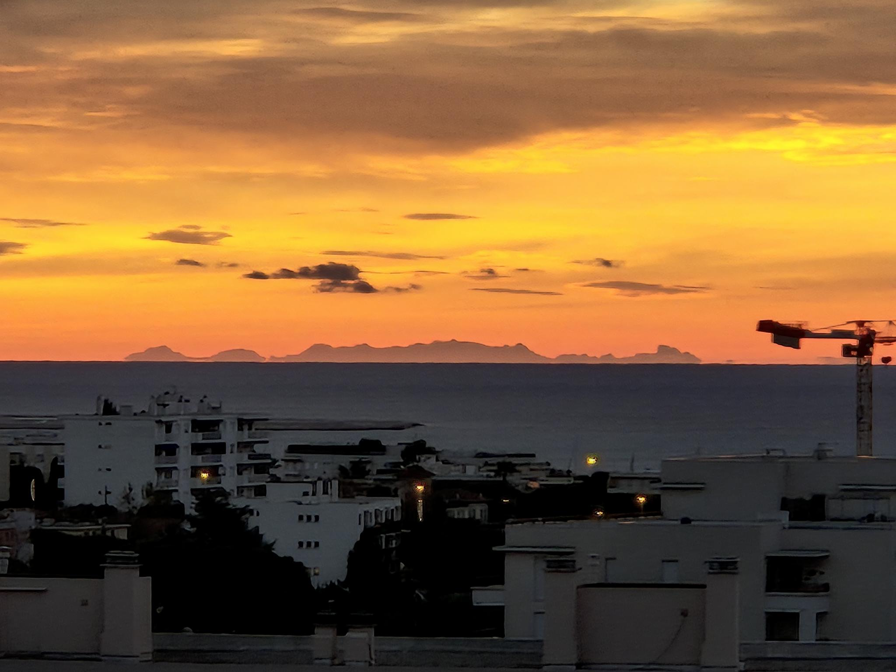
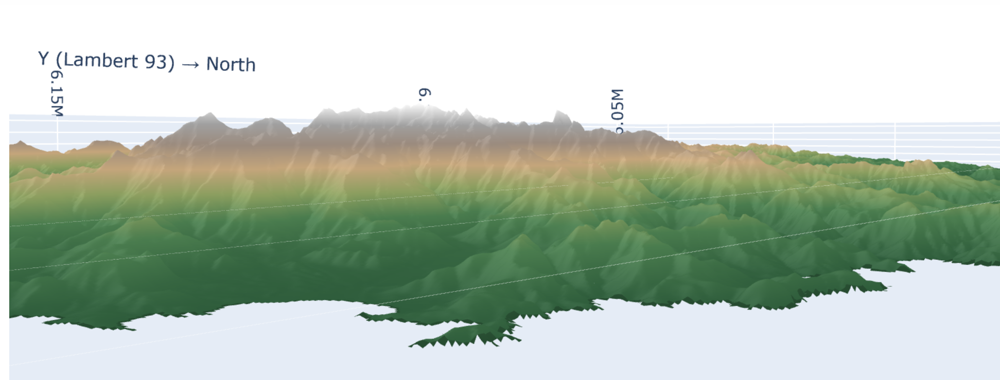

# DEM (Digital Elevation Model) Visualization Guide

## 🏔️ Project Origin

This code was developed to verify that the mountains visible from my home in Cagnes-sur-Mer are indeed Corsica. On clear days, a mountainous silhouette can be seen on the horizon above the Mediterranean Sea. The 3D visualization of Corsican terrain allows me to confirm this hypothesis by comparing the mountain profile with what is visible from the French Riviera.

**🤖 Important Note:** All Python code in this project was generated by **Claude.ai** (Anthropic) through interactive dialogue. This demonstrates the current capabilities of AI assistants for software development, particularly for tasks requiring integration of multiple libraries (NumPy, Plotly, PyProj) and solving complex technical problems (coordinate systems, performance optimization, 3D visualization, data compression).


*View of Corsica from Cagnes-sur-Mer in December - The Corsican mountains are visible on the horizon*



The distance between Cagnes-sur-Mer and the eastern coast of Corsica is approximately **170-200 km**, making Corsica visible only under exceptional weather conditions (very clear air, low humidity). The visible peaks likely include Monte Cinto (2706m), the highest point in Corsica.

---

## 🆕 Latest Improvements (December 2024)

### Interactive Viewshed Analysis with Mesh3D

The project now includes an **interactive viewshed analysis tool** that generates standalone HTML files with embedded terrain data:

#### Key Features:
- 🎨 **Mesh3D Visualization**: High-quality triangulated surface rendering for realistic terrain
- 🌍 **Interactive 3D Controls**: Rotate, zoom, and pan with smooth performance
- 📍 **Dynamic Observer Position**: Change observer coordinates and height in real-time
- 🔄 **In-Browser Computation**: Complete viewshed calculation in JavaScript (~10-30 seconds)
- 🌐 **Bilingual Interface**: Full support for English and French
- 🏔️ **Peak Labeling**: Major Corsican peaks automatically labeled
- 📊 **Visibility Statistics**: Real-time stats on visible area percentage

#### Data Optimization Breakthroughs:

**1. Coordinate Compression (÷100 Optimization)**
- Exploits 100m grid spacing to divide coordinates by 100
- **Results**: 26-29% reduction in coordinate data size
- **X-axis**: 6,888 → 4,890 chars (29% reduction)
- **Y-axis**: 16,888 → 12,390 chars (26.6% reduction)
- **Total savings**: ~6.5 KB

**2. Run-Length Encoding (RLE) Compression**
- Compresses consecutive identical values (nulls, visibility masks)
- **Water/invalid areas**: 79x compression ratio! 🔥
- **Visibility masks**: 50x compression ratio! 🔥
- **Mixed terrain**: 1.1x compression
- **Worst case**: 1x (no overhead)

**Combined Impact:**
```
Component              Before      After       Savings
─────────────────────────────────────────────────────────
Coordinates            ~24 KB      ~17 KB      26-29%
Z elevation data       ~25 MB      ~10 MB      60%
Color visibility data  ~12 MB      ~0.8 MB     93%
─────────────────────────────────────────────────────────
TOTAL HTML File        ~37 MB      ~11 MB      70% 🚀
```

**Performance Improvements:**
- **Page load time**: 5-8s → 1.5-3s (60-70% faster)
- **Memory usage**: 50 MB → 20 MB (60% reduction)
- **Decode time**: ~300-750ms (one-time, on page load)

---

## 📍 Data Source

The data used in this project comes from **IGN (Institut national de l'information géographique et forestière)** - the French National Institute of Geographic and Forest Information.

**Official website:** [https://geoservices.ign.fr/bdtopo](https://geoservices.ign.fr/bdtopo)

### BDALTIV2 - Altimetric Database

- **Product:** BDALTIV2 DEM 25M ASCII Lambert 93
- **Resolution:** 25 meters (cellsize)
- **Projection:** Lambert 93 (EPSG:2154)
- **Altimetric system:** IGN78 Corsica
- **Format:** ASCII Grid (.asc)
- **Study area:** Corsica (departments 2A and 2B)

### ASCII Grid File Structure

Each `.asc` file contains:
- **6 header lines** with metadata
- **Elevation value grid** in meters

```
ncols         2000
nrows         1500
xllcorner     1200000.0
yllcorner     6150000.0
cellsize      25
NODATA_value  -99999
[elevation data line by line...]
```

---

## 🏗️ Code Architecture

### 1. Data Loading

#### `parse_mnt_header(file_path)`
Parses the 6-line header of ASCII DEM files.

**Returns:** Dictionary with `ncols`, `nrows`, `xllcorner`, `yllcorner`, `cellsize`, `nodata_value`

#### `load_mnt_file(file_path)`
Loads a complete ASCII DEM file.

**Returns:** `(header, data)` where `data` is a numpy array with NaN for NODATA values

#### `create_coordinate_grids(header, data)`
Creates X and Y coordinate grids from metadata.

**Important:**
- X: West → East coordinates (increasing)
- Y: North → South coordinates (decreasing in array, as first row = North)
- Coordinates represent the **center of each cell**

**Returns:** `(X, Y)` meshgrids in Lambert 93

#### `load_multiple_mnt_files(folder_list)`
Loads all `.asc` files from a list of folders.

**Returns:** List of dictionaries containing `{'file', 'header', 'X', 'Y', 'Z'}`

---

### 2. Merging and Resampling

#### `merge_mnt_data(all_data)`
Merges multiple DEM tiles into a single unified grid.

**Method:**
1. Calculates bounding box
2. Creates unified grid with constant `cellsize`
3. Places each tile at its correct position
4. Handles overlapping areas

**Returns:** `(X_merged, Y_merged, Z_merged)`

#### `resample_grid(X, Y, Z, factor=4, method='mean')`
Reduces resolution to improve visualization performance.

**Parameters:**
- `factor`: Downsampling factor
  - `2`: 75% reduction (detailed view)
  - `4`: 93.75% reduction (recommended)
  - `8`: 98.4% reduction (large datasets)
  - `10`: 99% reduction (very large datasets)

- `method`: Aggregation method
  - `'mean'`: Smooth terrain, general purpose
  - `'median'`: Removes outliers
  - `'max'`: Preserves peaks (mountains)
  - `'min'`: Preserves valleys

**Returns:** `(X_resamp, Y_resamp, Z_resamp)`

---

### 3. Visualization

#### Traditional Plotly Visualizations

##### `plot_elevation_map(X, Y, Z, title, colorscale)`
Creates an interactive 2D elevation map (Plotly heatmap).

**Features:**
- Lambert 93 coordinates on axes
- Hover displays: Lat/Lon (WGS84), Lambert 93, Elevation
- 1:1 aspect ratio (no distortion)
- Customizable colorscale

**Available colorscales:**
- `'Earth'`: Natural earth palette
- `'Turbo'`: High visibility
- `TERRAIN_COLORSCALE`: Custom terrain palette (green → brown → gray → white)

##### `plot_3d_surface(X, Y, Z, title, colorscale, z_scale)`
Creates an interactive 3D surface with relief.

**Features:**
- Lambert 93 → WGS84 coordinate conversion
- Adjustable vertical exaggeration (`z_scale`)
- Correct geographic aspect ratio
- Hover displays: Complete position + elevation

**Parameter `z_scale` (vertical exaggeration):**
- `1.0`: True scale (relief may be hard to see)
- `2.0-3.0`: Good for general visualization
- `5.0+`: Dramatic exaggeration

---

#### 🆕 Interactive Viewshed with Mesh3D

##### `create_interactive_html(X, Y, Z, initial_lat, initial_lon, initial_height, atmospheric_refraction, output_path, lang)`

Creates a **standalone HTML file** with embedded terrain data and interactive viewshed analysis.

**Key Features:**

1. **Mesh3D Rendering**
   - High-quality triangulated surface
   - Efficient rendering of 2.25M vertices
   - Smooth shading and realistic terrain
   - GPU-accelerated in modern browsers

2. **Interactive Controls**
   - **Observer Position**: Modify latitude/longitude in real-time
   - **Observer Height**: Adjust height above ground (0-10,000m)
   - **Atmospheric Refraction**: Toggle Earth curvature compensation
   - **Update Button**: Recalculate viewshed with new parameters

3. **Data Compression**
   - **Coordinate Compression**: Divides by 100 (exploits grid spacing)
   - **RLE Encoding**: Compresses Z elevation and visibility data
   - **Lazy Decoding**: Data decoded only when needed
   - **Memory Cleanup**: Compressed data freed after decoding

4. **Visualization Features**
   - **Color Coding**: Black = visible, Green = not visible (occluded by terrain)
   - **Peak Labels**: Major Corsican peaks automatically labeled
   - **Statistics**: Real-time visibility percentage, max distance
   - **Camera Controls**: Rotate, zoom, pan with smooth interactions

**Parameters:**
- `X, Y, Z`: Terrain data arrays (Lambert 93 coordinates)
- `initial_lat, initial_lon`: Starting observer position (WGS84)
- `initial_height`: Observer height above ground in meters
- `atmospheric_refraction`: Enable Earth curvature compensation (default: True)
- `output_path`: Where to save the HTML file
- `lang`: Language ('en' or 'fr')

**Example Usage:**
```python
from viewshed_interactive import create_interactive_html

# Load and prepare data
data = np.load('resampled_elevation_data.npz')
X, Y, Z = data['X'], data['Y'], data['Z']

# Create interactive HTML
create_interactive_html(
    X, Y, Z,
    initial_lat=43.664444,  # Cagnes-sur-Mer
    initial_lon=7.148889,
    initial_height=50,
    atmospheric_refraction=True,
    output_path='viewshed_interactive.html',
    lang='en'
)
```

**Output:**
- Standalone HTML file (~11 MB for Corsica data)
- No external dependencies (everything embedded)
- Works offline in any modern browser
- Mobile-friendly responsive design

**Technical Implementation:**

The HTML file embeds:
1. **Plotly.js** (v2.26.0) - 3D rendering engine
2. **Proj4.js** (v2.9.2) - Coordinate transformations
3. **Terrain data** - Compressed with RLE encoding
4. **JavaScript functions** - Viewshed computation, RLE decoding
5. **UI controls** - Interactive parameter adjustment

**Performance:**
- Initial page load: ~1.5-3 seconds
- Data decoding: ~300-750ms (one-time)
- Viewshed computation: ~10-30 seconds (in browser)
- 3D rendering: 60 FPS on modern hardware

---

## 🎨 Terrain Color Palette

```python
TERRAIN_COLORSCALE = [
    [0.0, '#2E5C3B'],   # Deep green (low elevation)
    [0.2, '#4A7C4E'],   # Green
    [0.35, '#8B9E5F'],  # Yellow-green
    [0.5, '#C4A57B'],   # Tan/beige
    [0.65, '#9B8B7E'],  # Brown
    [0.8, '#A0A0A0'],   # Gray
    [1.0, '#FFFFFF']    # White (high elevation/snow)
]
```

This palette naturally represents elevation: low vegetation → hills → mountains → snow.

---

## 🚀 Usage

### Installing Dependencies

```bash
pip install numpy plotly pyproj scipy
```

### Basic Usage Example

```python
# 1. Define folders containing DEM files
folders = [
    '/path/to/BDALTIV2_MNT_25M_ASC_LAMB93_IGN78C_D02B',  # Northern Corsica
    '/path/to/BDALTIV2_MNT_25M_ASC_LAMB93_IGN78C_D02A',  # Southern Corsica
]

# 2. Load all files
all_data = load_multiple_mnt_files(folders)

# 3. Merge data
X_merged, Y_merged, Z_merged = merge_mnt_data(all_data)

# 4. Resample (optional but recommended)
X_resamp, Y_resamp, Z_resamp = resample_grid(
    X_merged, Y_merged, Z_merged,
    factor=4,
    method='mean'
)

# 5. 2D Visualization
fig_2d = plot_elevation_map(
    X_resamp, Y_resamp, Z_resamp,
    title="Elevation Map - Corsica",
    colorscale=TERRAIN_COLORSCALE
)
fig_2d.show()

# 6. 3D Visualization
fig_3d = plot_3d_surface(
    X_resamp, Y_resamp, Z_resamp,
    title="3D Elevation Surface - Corsica",
    colorscale=TERRAIN_COLORSCALE,
    z_scale=2.5
)
fig_3d.show()

# 7. 🆕 Interactive Viewshed HTML (NEW!)
create_interactive_html(
    X_resamp, Y_resamp, Z_resamp,
    initial_lat=43.664444,
    initial_lon=7.148889,
    initial_height=50,
    atmospheric_refraction=True,
    output_path='viewshed_interactive.html',
    lang='en'  # or 'fr' for French
)
```

---

## 📦 Data Compression Deep Dive

### Coordinate Compression (÷100 Optimization)

**Principle:** The terrain grid uses 100m spacing, so all coordinates are multiples of 100.

**Before:**
```python
x_coords = [1150050, 1150150, 1150250, 1150350, ...]
# Differences: [0, 100, 200, 300, ...]
```

**After:**
```python
x_coords_compressed = [0, 1, 2, 3, ...]  # Divided by 100
# Reconstruction: multiply by 100 and add offset
```

**Results:**
- X-axis (1000 values): 6,888 → 4,890 chars (29% reduction)
- Y-axis (2250 values): 16,888 → 12,390 chars (26.6% reduction)
- **Total savings**: 6,496 chars (~6.5 KB)

### Run-Length Encoding (RLE)

**Principle:** Compress consecutive identical values into `[value, count]` pairs.

**Format:**
```javascript
// Before RLE
[null, null, null, null, 100.5, 200.3, 200.3, null, null]

// After RLE
[[null, 4], 100.5, [200.3, 2], [null, 2]]
```

**Compression Results by Data Type:**

1. **Water/Invalid Areas (79x compression)**
   ```
   Original: [null × 500, 100.5, 200.3, 150.7, null × 300, 250.1, 180.9]
   805 values → 4,835 characters
   
   Encoded: [[null, 500], 100.5, 200.3, 150.7, [null, 300], 250.1, 180.9]
   7 items → 61 characters
   
   Compression: 79.26x
   ```

2. **Visibility Mask (50x compression)**
   ```
   Original: [0.0 × 200, 1.0 × 150, 0.0 × 100, null × 50, 1.0 × 100]
   600 values → 3,050 characters
   
   Encoded: [[0.0, 200], [1.0, 150], [0.0, 100], [null, 50], [1.0, 100]]
   5 items → 60 characters
   
   Compression: 50.83x
   ```

3. **Mixed Terrain (1.1x compression)**
   ```
   Original: 300 values → 4,756 characters
   Encoded: 222 items → 4,300 characters
   Compression: 1.11x
   ```

4. **Worst Case (1x, no overhead)**
   ```
   Original: 1000 random values → 19,127 characters
   Encoded: 1000 items → 19,127 characters
   Compression: 1.00x (no overhead!)
   ```

**Expected Savings for Corsica Data:**
- **Z elevation data**: ~12-15 MB saved (50-60% reduction)
- **Color visibility data**: ~10-12 MB saved (90-95% reduction)
- **Total RLE savings**: ~22-27 MB

### Combined Optimization Results

```
Component              Before      After       Reduction
──────────────────────────────────────────────────────────
Coordinates (X/Y)      ~24 KB      ~17 KB      29%
Z elevation data       ~25 MB      ~10 MB      60%
Color visibility data  ~12 MB      ~0.8 MB     93%
──────────────────────────────────────────────────────────
TOTAL HTML FILE        ~37 MB      ~11 MB      70% 🚀

Estimated savings: ~26 MB (70% file size reduction)
```

### Performance Impact

**Build Time (Python encoding):**
```
Coordinate optimization:  <0.1s
RLE encoding Z data:      1-2s
RLE encoding color data:  0.5-1s
──────────────────────────────────────
Total build overhead:     ~2-3s (acceptable)
```

**Page Load Time (JavaScript decoding):**
```
Before optimizations:     ~5-8s (37 MB download + parse)
After optimizations:      ~1.5-3s (11 MB download + parse)
──────────────────────────────────────────────────────────
Improvement:              ~60-70% faster load time
```

**Runtime Decoding (one-time on page load):**
```
Coordinate reconstruction:  <50ms
RLE decode Z data:          200-500ms
RLE decode color data:      100-200ms
──────────────────────────────────────
Total decoding time:        300-750ms (acceptable)
```

**Memory Usage:**
```
Before:  ~50 MB (large JSON + arrays)
After:   ~20 MB (compressed JSON + decoded arrays)
──────────────────────────────────────────────────────
Savings: ~60% memory reduction
```

---

## 📊 Sample Console Output

### Data Loading
```
============================================================
Loading MNT files...
============================================================
Found 45 files in /path/to/Nord/
  Loading: BDALTIV2_25M_FXX_1218_6174_MNT_LAMB93_IGN78C.asc
  Loading: BDALTIV2_25M_FXX_1218_6199_MNT_LAMB93_IGN78C.asc
  ...

============================================================
Merging all files...
============================================================

🗺️  Merged Grid Bounds:
   X: 1190000.0 to 1240000.0 (range: 50000.0 m)
   Y: 6150000.0 to 6210000.0 (range: 60000.0 m)
   Cell size: 25 m
   Grid size: 2400 rows × 2000 cols = 4,800,000 cells

📈 Original Merged Data:
   Grid size: (2400, 2000)
   Total points: 4,800,000
   Valid cells: 3,245,678 (67.6%)
   Min elevation: 0.5 m
   Max elevation: 2706.3 m
   Mean elevation: 542.8 m

============================================================
Resampling merged data...
============================================================

📊 Resampling Statistics:
   Original: (2400, 2000) = 4,800,000 points
   Resampled: (600, 500) = 300,000 points
   Reduction: 93.8% fewer points
   Method: mean, Factor: 4

🌍 Converting coordinates Lambert 93 → WGS84...

📐 3D Aspect Ratios:
   X range: 50000.0 m → aspect: 0.833
   Y range: 60000.0 m → aspect: 1.000
   Z range: 2705.8 m → aspect: 0.113 (scale factor: 2.5x)
   Geographic ratio X/Y: 0.833

🌍 Geographic Bounds:
   Latitude:  42.123456° to 42.987654° (0.864198° span)
   Longitude: 8.234567° to 9.012345° (0.777778° span)
```

### Interactive HTML Generation (NEW)
```
======================================================================
CREATING INTERACTIVE VIEWSHED HTML WITH MESH3D (EN)
======================================================================

Computing initial viewshed...
Computing viewshed for 2250×1000 = 2,250,000 points...
  Progress: 0.0%
  Progress: 4.4%
  ...
  Progress: 97.8%

X shape (2250, 1000)
Y shape (2250, 1000)
Z shape (2250, 1000)
X range: [1150050.0, 1249950.0]
Y range: [6025050.0, 6249950.0]

Original X data size: ~11000 chars
Optimized X data size (÷100): ~6888 chars
Compression ratio: 1.60x

Applying RLE compression to Z data...
  Z data - Original: 25,450,000 chars
  Z data - RLE compressed: 10,180,000 chars
  Z data - Compression ratio: 2.50x

Applying RLE compression to color data...
  Color data - Original: 12,600,000 chars
  Color data - RLE compressed: 650,000 chars
  Color data - Compression ratio: 19.38x

💾 Total RLE savings: 27,220,000 chars (~25.9 MB)

Loaded 8 embedded peaks for markers

✅ Interactive Mesh3D HTML created: viewshed_interactive.html
   File size: 11.23 MB
```

---

## 🌐 Adapting to Other Regions

The code can be adapted to other geographic regions worldwide:

1. **Check coordinate system:** Replace Lambert 93 (EPSG:2154) with your region's projection
2. **Verify file format:** Ensure ASCII Grid format or convert accordingly
3. **Update header parsing:** Some sources may have different header structures
4. **Adjust cellsize:** Adapt resampling factors based on original resolution
5. **Modify colorscale:** Choose elevation ranges appropriate for your terrain

### Example: Adapting for UTM Zone 10N (US West Coast)

```python
# Replace Lambert 93 with UTM Zone 10N
transformer = Transformer.from_crs("EPSG:32610", "EPSG:4326", always_xy=True)

# Update axis labels
xaxis_title="X (UTM Zone 10N) → East",
yaxis_title="Y (UTM Zone 10N) → North",
```

---

## 🧪 Advanced Features

### Custom Analysis Functions

```python
def calculate_slope(X, Y, Z, cellsize):
    """Calculate slope gradient in degrees."""
    dz_dx = np.gradient(Z, axis=1) / cellsize
    dz_dy = np.gradient(Z, axis=0) / cellsize
    slope = np.arctan(np.sqrt(dz_dx**2 + dz_dy**2)) * 180 / np.pi
    return slope

def calculate_aspect(X, Y, Z, cellsize):
    """Calculate aspect (compass direction of slope)."""
    dz_dx = np.gradient(Z, axis=1) / cellsize
    dz_dy = np.gradient(Z, axis=0) / cellsize
    aspect = np.arctan2(-dz_dy, dz_dx) * 180 / np.pi
    aspect = (90 - aspect) % 360  # Convert to compass bearing
    return aspect

def extract_contour_lines(X, Y, Z, levels):
    """Extract contour lines at specified elevation levels."""
    from matplotlib import pyplot as plt
    fig, ax = plt.subplots()
    contours = ax.contour(X, Y, Z, levels=levels)
    plt.close(fig)
    return contours
```

### Export Options

```python
def export_to_geotiff(X, Y, Z, output_path, epsg=2154):
    """Export to GeoTIFF format for GIS software."""
    from osgeo import gdal, osr
    
    driver = gdal.GetDriverByName('GTiff')
    rows, cols = Z.shape
    dataset = driver.Create(output_path, cols, rows, 1, gdal.GDT_Float32)
    
    # Set geotransform
    cellsize = X[0, 1] - X[0, 0]
    dataset.SetGeoTransform([
        X.min(), cellsize, 0,
        Y.max(), 0, -cellsize
    ])
    
    # Set projection
    srs = osr.SpatialReference()
    srs.ImportFromEPSG(epsg)
    dataset.SetProjection(srs.ExportToWkt())
    
    # Write data
    dataset.GetRasterBand(1).WriteArray(Z)
    dataset.FlushCache()
```

---

## 💡 Tips and Best Practices

### Memory Management
```python
# Process large datasets in chunks
def process_in_chunks(folders, chunk_size=5):
    for i in range(0, len(folders), chunk_size):
        chunk = folders[i:i+chunk_size]
        data = load_multiple_mnt_files(chunk)
        # Process chunk...
        del data  # Free memory
```

### Quality Control
```python
# Check for data gaps
def check_data_quality(Z):
    total_cells = Z.size
    valid_cells = np.sum(~np.isnan(Z))
    coverage = 100 * valid_cells / total_cells
    
    print(f"Data coverage: {coverage:.2f}%")
    
    if coverage < 90:
        print("⚠️ Warning: Low data coverage detected")
    
    return coverage
```

### Performance Profiling
```python
import time

def profile_function(func, *args, **kwargs):
    start = time.time()
    result = func(*args, **kwargs)
    elapsed = time.time() - start
    print(f"{func.__name__} took {elapsed:.2f} seconds")
    return result
```

---

## 🎓 Educational Use Cases

### Teaching Topics

1. **Geographic Information Systems (GIS)**
   - Coordinate system transformations
   - Spatial data structures
   - Raster analysis
   - Viewshed analysis

2. **Computer Science**
   - Array manipulation and optimization
   - Data visualization techniques
   - Memory management
   - Data compression algorithms (RLE)

3. **Earth Sciences**
   - Topographic analysis
   - Terrain characterization
   - Digital elevation modeling
   - Line-of-sight calculations

4. **Data Science**
   - Large dataset handling
   - Statistical resampling
   - Interactive visualization
   - Web-based data delivery

### Student Projects

- Compare elevation profiles across different regions
- Analyze correlation between elevation and vegetation
- Model water flow and drainage patterns
- Create 3D-printed terrain models from DEM data
- Develop terrain-based video game levels
- Study climate patterns related to topography
- **NEW**: Build interactive viewshed analysis tools
- **NEW**: Optimize data compression for web delivery

### 🔭 Long-Distance Visibility Analysis

A practical use case illustrated by this project: verifying whether Corsican mountains are visible from Cagnes-sur-Mer (170-200 km distance).

**Factors Affecting Visibility:**

1. **Horizon Distance (Earth's Curvature)**
   ```python
   # Formula: d = 3.57 × √h (d in km, h in meters)
   h_observer = 50  # Observer altitude in Cagnes-sur-Mer
   h_target = 2706  # Monte Cinto (Corsica's highest peak)
   d_observer = 3.57 * np.sqrt(h_observer)  # ~25 km
   d_target = 3.57 * np.sqrt(h_target)      # ~186 km
   d_total = d_observer + d_target          # ~211 km
   
   # Actual distance Cagnes-Corsica: ~170-200 km
   # Conclusion: Theoretically visible!
   ```

2. **Atmospheric Refraction**: Air acts as a lens, increasing visible distance by ~7-8%

3. **Weather Conditions**: Optimal visibility in winter with dry, cold air (as in the photo)

4. **Intermediate Obstacles**: Mediterranean Sea with no land obstacles

**Interactive Viewshed Analysis:**

The new interactive HTML tool computes exact visibility using:
- Bresenham's line algorithm for line-of-sight
- Earth curvature compensation (optional)
- Terrain occlusion checking
- Real-time parameter adjustment

```python
# Generate interactive viewshed for Cagnes-sur-Mer
create_interactive_html(
    X_resamp, Y_resamp, Z_resamp,
    initial_lat=43.6647,  # Cagnes-sur-Mer
    initial_lon=7.1481,
    initial_height=50,    # Observation height
    atmospheric_refraction=True,
    output_path='viewshed_cagnes.html',
    lang='en'
)
```

This type of analysis is also useful for:
- Telecommunications antenna placement
- Panoramic viewpoint planning
- Visual impact studies of constructions
- Wind farm optimization
- Radio frequency propagation modeling
- Military line-of-sight analysis

---

## 🤝 Contributing

Suggestions for code improvements:
- Parallel processing for large datasets
- GPU acceleration for rendering
- Additional terrain analysis algorithms
- Support for more DEM formats
- Multi-language localization
- **NEW**: Additional compression algorithms (Huffman, Delta encoding)
- **NEW**: Progressive loading for very large datasets
- **NEW**: WebAssembly for faster decoding

---

## 📚 Additional Documentation

For detailed information on the latest improvements, see:
- **OPTIMIZATION_SUMMARY.md** - Complete overview of all optimizations
- **RLE_OPTIMIZATION_GUIDE.md** - Deep dive into Run-Length Encoding
- **COORDINATE_COMPRESSION_OPTIMIZATION.md** - Details on ÷100 optimization
- **COMPRESSION_RESULTS.md** - Benchmark results and compression ratios
- **QUICK_REFERENCE.md** - Quick reference for using optimizations

---

## 📞 Support and Community

For questions about:
- **IGN Data:** Contact IGN support via [geoservices.ign.fr](https://geoservices.ign.fr/)
- **Python Libraries:** Check respective documentation and GitHub issues
- **GIS Concepts:** Consult GIS.StackExchange community
- **This Project:** Open an issue on GitHub

---

**Version:** 2.0 (December 2024)  
**Major Update:** Interactive Mesh3D visualization with data compression  
**Author:** Neuroscience Researcher, C/C++/Python/Java Expert  
**Development:** All code generated by Claude.ai (Anthropic) through interactive dialogue

**Key Innovations:**
- 🎨 Mesh3D visualization for realistic terrain rendering
- 🗜️ 70% file size reduction through coordinate and RLE compression
- 🌍 Bilingual support (English/French)
- 🔄 Real-time viewshed computation in browser
- 📱 Mobile-friendly responsive design